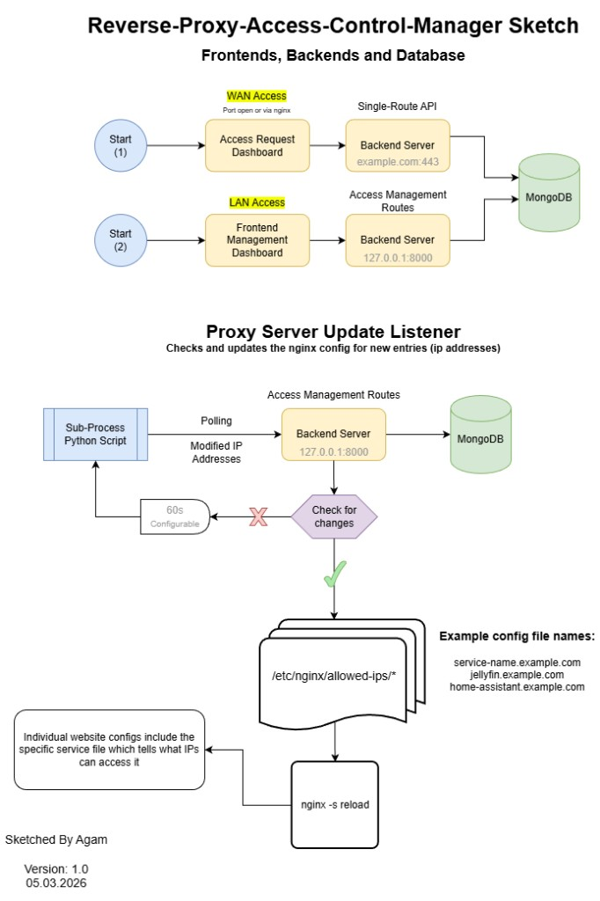

# proxy-listener

Sub-process script for the **Reverse Proxy Access Control Manager**. Polls the backend for modified IP addresses and updates Nginx access control configs.



## What it does

1. **Polls** the Access Management backend (`127.0.0.1:8000`) for modified IP addresses (configurable interval, e.g. 60s).
2. **Checks for changes** — if none, waits and polls again.
3. **Updates** `/etc/nginx/allowed-ips/*` config files (e.g. `jellyfin.example.com`, `home-assistant.example.com`). Each file defines which IPs can access that service.
4. **Reloads** Nginx (`nginx -s reload`) to apply changes.

## Run

```bash
uv run python main.py
```
